# FreelanceTrace Admin Authentication - Sequence Diagram

## Overview
This diagram shows the complete authentication flow for admin users, including both sign-in and sign-up processes with role-based access control.

---

## Mermaid Sequence Diagram

```mermaid
sequenceDiagram
    autonumber
    
    participant User as Admin User
    participant Browser as Browser
    participant AdminAuth as AdminAuth Page
    participant AuthCtx as AuthContext
    participant API as Backend API
    participant DB as Database
    
    %% Admin Sign Up Flow
    rect rgb(240, 248, 255)
        Note over User,DB: Admin Sign Up Flow
        User->>Browser: Navigate to /admin/auth
        Browser->>AdminAuth: Load Admin Auth Page
        AdminAuth->>User: Display Sign Up Form
        
        User->>AdminAuth: Enter credentials + secret key
        AdminAuth->>AdminAuth: Validate form inputs
        AdminAuth->>AuthCtx: adminSignUp(email, password, name, secretKey)
        
        AuthCtx->>API: POST /auth/admin/signup<br/>{email, password, full_name, secret_key}
        
        API->>API: Verify secret_key matches ADMIN_SECRET_KEY
        
        alt Secret Key Invalid
            API-->>AuthCtx: 403 Forbidden
            AuthCtx-->>AdminAuth: Error: Invalid secret key
            AdminAuth-->>User: Show error toast
        else Secret Key Valid
            API->>DB: Check if email exists
            
            alt Email Already Exists
                DB-->>API: User found
                API-->>AuthCtx: 400 Email already registered
                AuthCtx-->>AdminAuth: Error message
                AdminAuth-->>User: Show error toast
            else Email Available
                DB-->>API: No user found
                API->>API: Hash password
                API->>DB: INSERT User (role='admin')
                DB-->>API: User created
                API->>API: Generate JWT token
                API-->>AuthCtx: 200 {token, user, profile}
                AuthCtx->>AuthCtx: Store token in localStorage
                AuthCtx->>AuthCtx: Set user & profile state
                AuthCtx-->>AdminAuth: Success
                AdminAuth-->>Browser: Navigate to /admin/dashboard
                Browser-->>User: Show Admin Dashboard
            end
        end
    end
    
    %% Admin Sign In Flow
    rect rgb(255, 250, 240)
        Note over User,DB: Admin Sign In Flow
        User->>Browser: Navigate to /admin/auth
        Browser->>AdminAuth: Load Admin Auth Page
        AdminAuth->>User: Display Sign In Form
        
        User->>AdminAuth: Enter email & password
        AdminAuth->>AdminAuth: Validate form inputs
        AdminAuth->>AuthCtx: signIn(email, password, 'admin')
        
        AuthCtx->>API: POST /auth/login<br/>{email, password}
        
        API->>DB: Query User by email
        
        alt User Not Found or Wrong Password
            DB-->>API: No match
            API-->>AuthCtx: 401 Invalid credentials
            AuthCtx-->>AdminAuth: Error message
            AdminAuth-->>User: Show error toast
        else Credentials Valid
            DB-->>API: User found
            API->>API: Verify password hash
            API->>API: Generate JWT token
            API-->>AuthCtx: 200 {token, user, profile}
            
            AuthCtx->>AuthCtx: Check if profile.role === 'admin'
            
            alt Role is NOT Admin
                AuthCtx-->>AdminAuth: Error: Not an admin account
                AdminAuth-->>User: Show error toast
            else Role is Admin
                AuthCtx->>AuthCtx: Store token in localStorage
                AuthCtx->>AuthCtx: Set user & profile state
                AuthCtx-->>AdminAuth: Success
                AdminAuth-->>Browser: Navigate to /admin/dashboard
                Browser-->>User: Show Admin Dashboard
            end
        end
    end
    
    %% Session Validation
    rect rgb(240, 255, 240)
        Note over User,DB: Session Validation on Page Load
        User->>Browser: Navigate to /admin/dashboard
        Browser->>AuthCtx: useEffect - Check session
        AuthCtx->>AuthCtx: Get token from localStorage
        
        alt Token Exists
            AuthCtx->>API: GET /auth/me<br/>Authorization: Bearer {token}
            API->>API: Verify JWT token
            API->>DB: Query User by token
            DB-->>API: User profile
            API-->>AuthCtx: 200 {user, profile}
            AuthCtx->>AuthCtx: Set user & profile state
            
            alt User Role is Admin
                AuthCtx-->>Browser: Allow access
                Browser-->>User: Show Admin Dashboard
            else User Role is NOT Admin
                AuthCtx-->>Browser: Redirect to appropriate dashboard
                Browser-->>User: Redirect based on role
            end
        else No Token
            AuthCtx-->>Browser: Redirect to /admin/auth
            Browser-->>User: Show Admin Auth Page
        end
    end
```



---

## Key Components

### Frontend
- **AdminAuth Page** (`/admin/auth`) - Dedicated admin authentication UI
- **AuthContext** - Manages authentication state and API calls
- **ProtectedRoute** - Role-based route guard

### Backend
- **POST /auth/admin/signup** - Admin account creation (requires secret key)
- **POST /auth/login** - Universal login endpoint (role determined by DB)
- **GET /auth/me** - Session validation endpoint

### Security Features
1. **Secret Key Validation** - Admin signup requires `ADMIN_SECRET_KEY` from environment
2. **Role-Based Access Control** - Frontend validates role after login
3. **JWT Token Authentication** - Secure session management
4. **Password Hashing** - Werkzeug security for password storage

---

## How to View This Diagram

### Option 1: GitHub/GitLab
Push this file to your repository - GitHub and GitLab render Mermaid diagrams automatically.

### Option 2: VS Code
Install the "Markdown Preview Mermaid Support" extension and preview this file.

### Option 3: Online Editors
- [Mermaid Live Editor](https://mermaid.live/) - Copy the diagram code
- [Mermaid Chart](https://www.mermaidchart.com/) - Professional diagram editor

### Option 4: Export as Image
Use the Mermaid CLI:
```bash
npm install -g @mermaid-js/mermaid-cli
mmdc -i ADMIN_AUTH_SEQUENCE_DIAGRAM.md -o admin-auth-diagram.png
```

---

## Admin Secret Key

**Default Key:** `freelancetrace-admin-2024`

**Location:** `backend/.env` → `ADMIN_SECRET_KEY`

**To Change:** Update the value in `.env` and restart the backend server.

---

## Flow Summary

### Sign Up
1. User enters credentials + secret key
2. Backend validates secret key
3. If valid, creates admin user in database
4. Returns JWT token
5. User redirected to admin dashboard

### Sign In
1. User enters email & password
2. Backend validates credentials
3. Returns user profile with role
4. Frontend checks if role === 'admin'
5. If admin, allow access; otherwise reject

### Session Persistence
1. Token stored in localStorage
2. On page load, token sent to `/auth/me`
3. Backend validates token and returns profile
4. Frontend checks role and grants/denies access
