# FreelanceTrace Platform - Complete Sequence Diagram

## Professional End-to-End Flow

```mermaid
sequenceDiagram
    autonumber
    
    participant C as Client
    participant F as Freelancer
    participant A as Admin
    participant UI as Frontend
    participant API as Backend API
    participant DB as Database
    participant GH as GitHub
    participant AI as Gemini AI
    
    %% ========== AUTHENTICATION ==========
    rect rgb(240, 248, 255)
        Note over C,DB: 1. AUTHENTICATION & ONBOARDING
        
        C->>UI: Sign Up (Client)
        UI->>API: POST /auth/signup {email, password, role: 'client'}
        API->>DB: Create User (role='client')
        DB-->>API: User Created
        API-->>UI: {token, user, profile}
        UI->>UI: Store JWT in localStorage
        UI-->>C: Redirect to /client/dashboard
        
        F->>UI: Sign Up (Freelancer)
        UI->>API: POST /auth/signup {email, password, role: 'freelancer'}
        API->>DB: Create User (role='freelancer')
        DB-->>API: User Created
        API-->>UI: {token, user, profile}
        UI-->>F: Redirect to /freelancer/dashboard
        
        A->>UI: Navigate to /admin/auth
        A->>UI: Sign Up with Secret Key
        UI->>API: POST /auth/admin/signup {email, password, secret_key}
        API->>API: Verify ADMIN_SECRET_KEY
        API->>DB: Create User (role='admin')
        DB-->>API: Admin Created
        API-->>UI: {token, user, profile}
        UI-->>A: Redirect to /admin/dashboard
    end
    
    %% ========== PROJECT CREATION ==========
    rect rgb(255, 250, 240)
        Note over C,AI: 2. PROJECT CREATION & SRS UPLOAD
        
        C->>UI: Navigate to /client/create-project
        C->>UI: Fill Project Form (title, budget, tech stack)
        C->>UI: Upload SRS Document (PDF/DOCX)
        UI->>API: POST /uploads/srs {file}
        API-->>UI: {url: 'uploads/srs-123.pdf'}
        
        UI->>API: POST /projects {project, requirements: []}
        API->>DB: INSERT Project
        DB-->>API: Project Created (id=1)
        
        C->>UI: Click "Upload SRS" on Project Detail
        UI->>API: POST /projects/1/upload_srs {file}
        API->>AI: Extract Requirements via Gemini API
        AI-->>API: Structured Requirements Array
        API->>DB: INSERT Requirements (bulk)
        DB-->>API: Requirements Saved
        API-->>UI: {requirements_extracted: 15, pipeline: 'gemini'}
        UI-->>C: Show Success Toast + Requirements List
    end
    
    %% ========== FREELANCER BIDDING ==========
    rect rgb(240, 255, 240)
        Note over F,DB: 3. FREELANCER DISCOVERS & BIDS
        
        F->>UI: Navigate to /freelancer/browse
        UI->>API: GET /projects?status=open&visibility=public
        API->>DB: Query Open Projects
        DB-->>API: Projects List
        API-->>UI: Projects with Client Info
        UI-->>F: Display Project Cards
        
        F->>UI: Click "Submit Bid" on Project
        F->>UI: Enter Amount, Duration, Proposal
        UI->>API: POST /projects/1/bids {amount, duration, proposal}
        API->>DB: INSERT Bid (status='pending')
        DB-->>API: Bid Created
        API-->>UI: Bid Submitted
        UI-->>F: Show Success Toast
    end
    
    %% ========== BID ACCEPTANCE ==========
    rect rgb(255, 245, 240)
        Note over C,DB: 4. CLIENT REVIEWS & ACCEPTS BID
        
        C->>UI: Navigate to /client/projects/1?tab=bids
        UI->>API: GET /projects/1/bids
        API->>DB: Query Bids for Project
        DB-->>API: Bids with Freelancer Profiles
        API-->>UI: Bids List
        UI-->>C: Display Bid Cards
        
        C->>UI: Click "Accept Bid"
        UI->>API: PATCH /bids/5 {status: 'accepted'}
        API->>DB: UPDATE Bid (status='accepted')
        API->>DB: UPDATE Project (status='in_progress', awarded_freelancer_id)
        API->>DB: UPDATE Other Bids (status='rejected')
        DB-->>API: Updates Complete
        API-->>UI: Bid Accepted
        UI-->>C: Show Success + Contract Created
    end
    
    %% ========== GITHUB INTEGRATION ==========
    rect rgb(245, 240, 255)
        Note over F,GH: 5. GITHUB REPOSITORY LINKING
        
        F->>UI: Navigate to /freelancer/projects/1
        F->>UI: Click "Link GitHub Repository"
        UI->>API: POST /github/oauth/url
        API-->>UI: {url: 'github.com/login/oauth/authorize?...'}
        UI->>GH: Redirect to GitHub OAuth
        F->>GH: Authorize FreelanceTrace App
        GH->>API: GET /github/oauth/callback?code=xyz&state=abc
        API->>GH: Exchange Code for Access Token
        GH-->>API: {access_token}
        API->>DB: UPDATE User (github_access_token)
        DB-->>API: Token Saved
        API-->>UI: Redirect to /freelancer/projects/1
        
        F->>UI: Select Repository from Dropdown
        UI->>API: POST /projects/1/github/link {repo_url, owner, name}
        API->>GH: Create Webhook (push events)
        GH-->>API: {webhook_id}
        API->>DB: INSERT GitHubRepository
        DB-->>API: Repository Linked
        API-->>UI: Repository Connected
        UI-->>F: Show Success Toast
    end
    
    %% ========== COMMIT TRACKING ==========
    rect rgb(240, 255, 255)
        Note over F,AI: 6. COMMIT PUSH & TRACEABILITY
        
        F->>GH: git push origin main
        GH->>API: POST /webhooks/github {commits, ref, repository}
        API->>API: Verify Webhook Signature
        API->>DB: Query Project by Repository
        DB-->>API: Project Found
        
        loop For Each Commit
            API->>DB: INSERT Commit (hash, message, author, files)
            API->>AI: Generate Embedding for Commit Message
            AI-->>API: Embedding Vector
            API->>DB: Query Requirements with Embeddings
            DB-->>API: Requirements List
            API->>API: Calculate Similarity Scores
            
            alt Similarity > Threshold (0.40)
                API->>DB: INSERT TraceLink (requirement_id, commit_id, score)
                API->>DB: UPDATE Requirement (coverage_percentage, status)
            end
        end
        
        DB-->>API: Commits & Links Saved
        API-->>GH: 200 OK
        
        F->>UI: Navigate to /freelancer/projects/1?tab=commits
        UI->>API: GET /projects/1/commits
        API->>DB: Query Commits with TraceLinks
        DB-->>API: Commits + Linked Requirements
        API-->>UI: Commits List
        UI-->>F: Display Commit Cards with Traceability
    end
    
    %% ========== ANALYTICS & METRICS ==========
    rect rgb(255, 240, 245)
        Note over C,DB: 7. PROJECT ANALYTICS & METRICS
        
        C->>UI: Navigate to /client/projects/1?tab=analytics
        UI->>API: GET /projects/1/metrics
        API->>DB: Query Requirements, Commits, TraceLinks
        DB-->>API: Raw Data
        
        API->>API: Calculate Fulfillment Score
        API->>API: Detect Requirement Drift
        API->>API: Predict Delay Risk
        API->>API: Compute Trust Score
        API->>API: Calculate Compliance Readiness
        
        API-->>UI: {fulfillment: 85%, drift: 12%, risk: 'low', ...}
        UI-->>C: Display Metrics Dashboard with Charts
        
        C->>UI: View Traceability Matrix
        UI->>API: GET /api/projects/1/traceability
        API->>DB: Query Requirements with Coverage
        DB-->>API: Requirements + Commit Counts
        API-->>UI: Traceability Matrix
        UI-->>C: Display Requirement Coverage Table
    end
    
    %% ========== MILESTONE PAYMENTS ==========
    rect rgb(250, 255, 240)
        Note over C,F: 8. MILESTONE COMPLETION & PAYMENT
        
        F->>UI: Navigate to /freelancer/projects/1
        F->>UI: Mark Milestone as "Completed"
        UI->>API: PATCH /milestones/3 {status: 'completed'}
        API->>DB: UPDATE Milestone (status='completed')
        DB-->>API: Milestone Updated
        API-->>UI: Milestone Marked Complete
        UI-->>F: Show Success Toast
        
        C->>UI: Navigate to /client/projects/1?tab=milestones
        UI->>API: GET /projects/1/milestones
        API->>DB: Query Milestones
        DB-->>API: Milestones List
        API-->>UI: Milestones with Status
        UI-->>C: Display Milestone Cards
        
        C->>UI: Click "Approve Milestone"
        UI->>API: PATCH /milestones/3 {status: 'approved'}
        API->>DB: UPDATE Milestone (status='approved', paid_at)
        API->>DB: UPDATE User.total_earnings (Freelancer)
        API->>DB: UPDATE User.total_spent (Client)
        DB-->>API: Payment Processed
        API-->>UI: Milestone Approved
        UI-->>C: Show Success Toast
    end
    
    %% ========== ADMIN MONITORING ==========
    rect rgb(245, 245, 250)
        Note over A,DB: 9. ADMIN PLATFORM MANAGEMENT
        
        A->>UI: Navigate to /admin/dashboard
        UI->>API: GET /admin/stats
        API->>DB: Aggregate Users, Projects, Bids
        DB-->>API: Platform Statistics
        API-->>UI: {users: {...}, projects: {...}, monthly: [...]}
        UI-->>A: Display Stats Cards + Charts
        
        A->>UI: Navigate to /admin/projects
        UI->>API: GET /projects (all)
        API->>DB: Query All Projects
        DB-->>API: Projects List
        API-->>UI: Projects by Status
        UI-->>A: Display Kanban Board (5 columns)
        
        A->>UI: Navigate to /admin/users
        UI->>API: GET /admin/profiles
        API->>DB: Query All Users
        DB-->>API: Users List
        API-->>UI: Users with Roles
        UI-->>A: Display User Table
        
        A->>UI: Click "Suspend User"
        UI->>API: PATCH /admin/profiles/7 {is_suspended: true}
        API->>DB: UPDATE User (is_suspended=true)
        DB-->>API: User Suspended
        API-->>UI: User Updated
        UI-->>A: Show Success Toast
        
        A->>UI: Navigate to /admin/analytics
        UI->>API: GET /admin/stats
        API->>DB: Query Aggregated Data
        DB-->>API: Stats + Monthly Trends
        API-->>UI: Complete Analytics Data
        UI-->>A: Display Charts (Pie, Bar, Radar, Area)
    end
    
    %% ========== PROJECT COMPLETION ==========
    rect rgb(240, 255, 240)
        Note over C,F: 10. PROJECT COMPLETION
        
        C->>UI: Navigate to /client/projects/1
        C->>UI: Click "Mark as Completed"
        UI->>API: PATCH /projects/1 {status: 'completed'}
        API->>DB: UPDATE Project (status='completed', completed_at)
        API->>DB: UPDATE User.projects_completed (Client & Freelancer)
        API->>DB: UPDATE User.trust_score (based on metrics)
        DB-->>API: Project Completed
        API-->>UI: Project Marked Complete
        UI-->>C: Show Success Toast
        
        F->>UI: Navigate to /freelancer/earnings
        UI->>API: GET /milestones?freelancer_id=X&status=approved
        API->>DB: Query Approved Milestones
        DB-->>API: Earnings Data
        API-->>UI: {totalAmount, thisMonth, pending, ...}
        UI-->>F: Display Earnings Dashboard + Chart
    end
```

---

## Key Features Illustrated

### 1. **Role-Based Authentication**
- Client, Freelancer, Admin sign-up/sign-in
- JWT token-based session management
- Admin requires secret key for signup

### 2. **AI-Powered SRS Processing**
- Gemini AI extracts structured requirements from PDF/DOCX
- Automatic requirement parsing and categorization
- Bulk requirement insertion

### 3. **Bidding System**
- Freelancers browse open projects
- Submit bids with proposals
- Clients review and accept/reject bids

### 4. **GitHub Integration**
- OAuth-based repository linking
- Webhook for automatic commit tracking
- Real-time push event processing

### 5. **AI Traceability Engine**
- Sentence-BERT embeddings for commits & requirements
- Cosine similarity matching (threshold: 0.40)
- Automatic trace link creation
- Coverage percentage calculation

### 6. **Analytics & Metrics**
- Fulfillment score (requirement coverage)
- Drift detection (unlinked requirements)
- Delay risk prediction
- Trust score computation
- Compliance readiness

### 7. **Milestone-Based Payments**
- Freelancer marks milestones complete
- Client approves and releases payment
- Automatic earnings/spending tracking

### 8. **Admin Portal**
- Platform-wide statistics
- User management (suspend/verify)
- Project kanban board
- Advanced analytics with charts

### 9. **Real-Time Updates**
- React Query for automatic cache invalidation
- Toast notifications for user feedback
- Optimistic UI updates

### 10. **Security**
- Password hashing (Werkzeug)
- JWT authentication
- Webhook signature verification
- Role-based access control (RBAC)

---

## Technology Stack

| Layer | Technologies |
|---|---|
| **Frontend** | React, TypeScript, TanStack Query, Tailwind CSS, Recharts |
| **Backend** | Flask, SQLAlchemy, Python |
| **Database** | SQLite (dev), PostgreSQL (prod) |
| **AI/ML** | Gemini API, Sentence-BERT, spaCy, KeyBERT |
| **VCS** | GitHub API, Webhooks |
| **Auth** | JWT, OAuth 2.0 |

---

## API Endpoints Summary

### Authentication
- `POST /auth/signup` - User registration
- `POST /auth/login` - User login
- `POST /auth/admin/signup` - Admin registration (requires secret)
- `GET /auth/me` - Session validation
- `POST /auth/logout` - Logout

### Projects
- `GET /projects` - List projects (filterable)
- `POST /projects` - Create project
- `GET /projects/:id` - Get project details
- `PATCH /projects/:id` - Update project
- `DELETE /projects/:id` - Delete project

### Requirements
- `POST /projects/:id/upload_srs` - AI requirement extraction
- `GET /projects/:id/requirements` - List requirements
- `POST /projects/:id/requirements` - Add requirement
- `PATCH /requirements/:id` - Update requirement
- `DELETE /requirements/:id` - Delete requirement

### Bids
- `GET /projects/:id/bids` - List project bids
- `POST /projects/:id/bids` - Submit bid
- `PATCH /bids/:id` - Accept/reject bid
- `DELETE /bids/:id` - Delete bid

### GitHub
- `POST /github/oauth/url` - Get OAuth URL
- `GET /github/oauth/callback` - OAuth callback
- `GET /github/repos` - List user repositories
- `POST /projects/:id/github/link` - Link repository
- `POST /projects/:id/github/sync` - Sync commits
- `POST /webhooks/github` - Webhook receiver

### Analytics
- `GET /projects/:id/metrics` - Project metrics
- `GET /api/projects/:id/traceability` - Traceability matrix
- `GET /projects/:id/commits` - List commits

### Admin
- `GET /admin/profiles` - List all users
- `PATCH /admin/profiles/:id` - Update user
- `GET /admin/stats` - Platform statistics

---

## How to View This Diagram

1. **GitHub/GitLab**: Push this file - renders automatically
2. **VS Code**: Install "Markdown Preview Mermaid Support" extension
3. **Online**: Copy code to [mermaid.live](https://mermaid.live)
4. **Export PNG**: Use `mmdc -i FREELANCETRACE_COMPLETE_SEQUENCE_DIAGRAM.md -o diagram.png`

---

## Diagram Legend

| Color | Represents |
|---|---|
| Light Blue | Authentication & Onboarding |
| Light Orange | Project Creation & SRS |
| Light Green | Bidding & Acceptance |
| Light Pink | GitHub Integration |
| Light Cyan | Commit Tracking & AI |
| Light Rose | Analytics & Metrics |
| Light Yellow | Payments & Milestones |
| Light Gray | Admin Management |

---

**Total Flows**: 10 major workflows  
**Total Steps**: 100+ sequence steps  
**Actors**: 3 user roles + 4 systems  
**API Endpoints**: 35+ endpoints  
**AI Components**: 2 (Gemini, Sentence-BERT)
